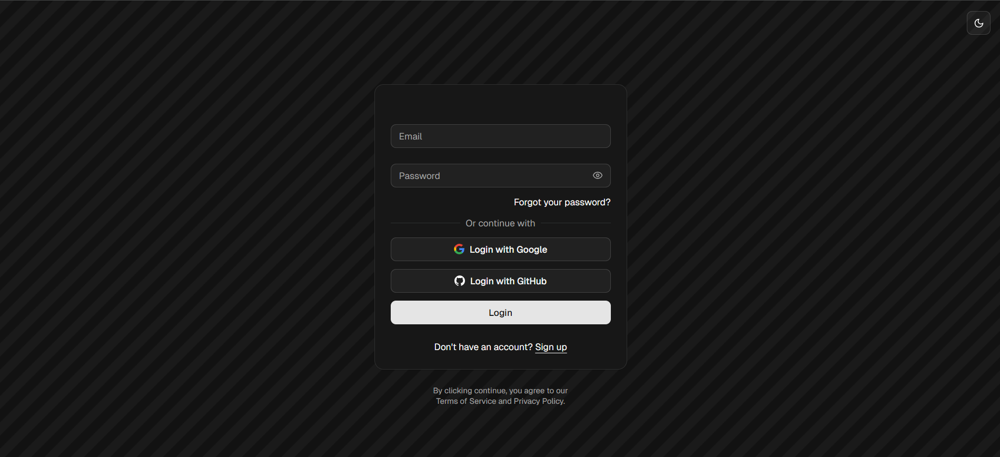
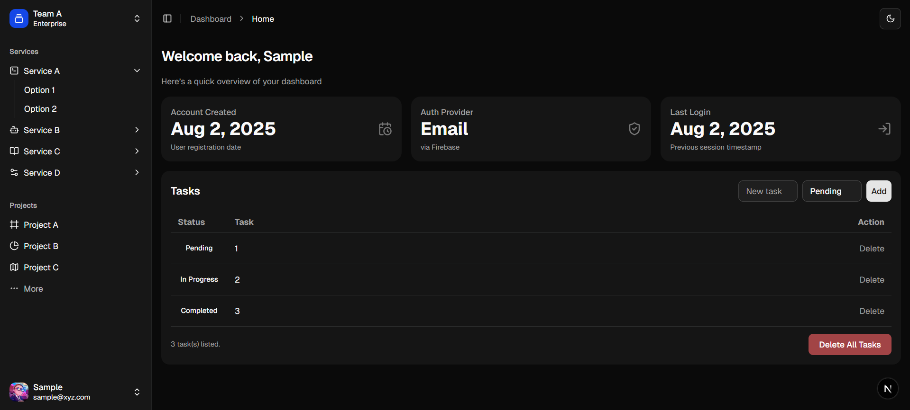

# 🎧 AIM-Dashboard

A modern and responsive dashboard application built with **Next.js**, **Firebase Auth**, **Firestore**, and **TailwindCSS**. Deployed on **Vercel**.

## ✨ Features

- 🔐 Firebase Authentication (Email, Google, GitHub)
- 📋 Task Management with real-time updates
- 🎨 Dark-themed animated login/signup pages
- 🧩 Modular components (Button, Dropdown, Pattern, Loader)
- 🚀 Deployed and production-ready

## 📸 Screenshots

## 🛠️ Tech Stack

- **Frontend**: React, Next.js 14, TailwindCSS
- **Backend/Auth**: Firebase Auth, Firestore
- **Deployment**: Vercel
- **Design**: Lucide Icons, custom animations

